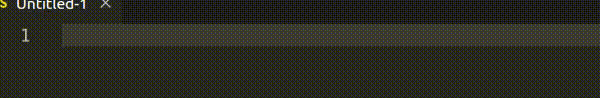

# import-underscore

Snippets to add `import _ from 'underscore';`.

## Snippets

There are only two snippets: `imu` and `im_` that have the same result:
```js
import _ from 'underscore';
```





Supported languages: js, jsx, ts, tsx.
